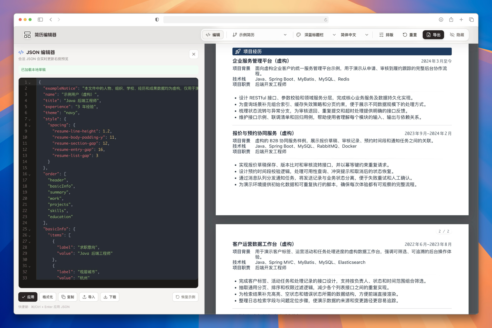

# Resume Generator

一个 AI 友好，基于 JSON 数据源、本地优先的通用简历生成器。可以本地/在线编辑、预览和导出简历。

## Features

- 本地优先：数据都在本地，JSON 格式，并且提示词都写好了，可以让 AI 直接修改、生成和优化简历内容
- 灵活自由：方便自定义模板、主题和排版
- 多版本支持：支持创建多个简历版本，便于针对不同岗位定制
- 在线预览：支持在浏览器中实时预览简历效果
- 导出：支持导出 PDF、PNG 等格式

## Best Practices

> 在线版仅供演示，建议在本地使用。

1. 确定主题：用默认的模板，或者让 AI 帮你定制化主题和风格
2. 确定模块：如果现有的模块不够用，可以让 AI 帮你生成新的模块
3. 确定内容：自己写，或者让 AI 阅读你的工作内容，逐个板块填充
4. 内容优化：让 AI 帮你优化内容，或者针对内容进行提问，找到风险点和优化点
5. 导出发布：生成想要的格式进行使用
6. 不断优化：创建不同的分支和版本，针对不同的岗位和公司进行优化

## License

项目原创代码及 `data-example/` 中的原创示例内容采用 [MIT License](LICENSE) 发布。第三方依赖、图标和其他明确标注的第三方内容仍适用各自的许可证，详见 [THIRD_PARTY_NOTICES.md](THIRD_PARTY_NOTICES.md)。用户创建或导入的简历内容不因使用本项目而改变权利归属。

示例人物、组织、学校、经历和成果数据均为虚构，仅用于演示模板结构，不指向任何真实个人或机构。请勿把示例内容直接作为真实简历使用。

## Privacy boundary

公开仓库只包含 `data-example/` 虚构模板。真实 `data/`、`output/` 中的构建产物、历史材料、个人附件和本地工具文件不应提交。静态版的编辑内容保存在当前浏览器的 IndexedDB/localStorage 中；项目目前不会将简历数据上传到外部服务。JSON 编辑器的“恢复示例”会用当前内置版本的 `data-example` 覆盖该版本的本地草稿。

## 友链

[Linux Do](https://linux.do)
